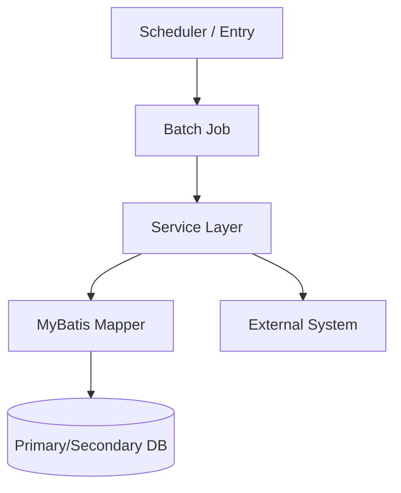
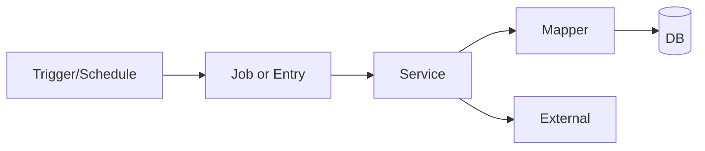

# CT Init

사용자 입력: $ARGUMENTS

## 목적
- init 이후 프로젝트 기준 문서 3종을 즉시 준비한다.
- 생성 대상:
  - `.0_my/core_project.md`
  - `.0_my/core_code_style.md`
  - `.0_my/core_workflow.md`
- `AGENTS.md`는 라우팅 전용으로 유지하고, 상세 내용은 `core_*` 3종으로 분리한다.

## 사용 시점
- 새 저장소를 세팅한 직후
- `.0_my` 문서가 없거나 초기 상태로 재생성해야 할 때
- `AGENTS.md`가 비대해져 상세를 `core_*` 문서로 분리하려고 할 때

## 실행 방식
- 이 커맨드는 스크립트를 실행하지 않는다.
- 아래 Markdown 포맷에 따라 파일을 직접 작성한다.

## 파일 생성 정책
- 기본 동작은 **항상 최신 포맷으로 재생성**이다.
- 대상 파일이 이미 있으면 덮어쓴다. 필요하면 삭제 후 재생성해도 된다.
- 기존 내용 보존을 위한 안전 편집/부분 병합은 하지 않는다.

## core 문서 메타/중복 제거 공통 규칙
- `core_project.md`, `core_code_style.md`, `core_workflow.md`의 `문서 메타`에는 아래 항목을 항상 같은 순서로 넣는다.
  - `생성일`
  - `목적`
  - `문서 성격`
  - `책임 범위(정본)`
  - `포함 범위`
  - `제외 범위`
  - `연계 문서`
  - `중복 방지 기준`
- `책임 범위(정본)`은 "이 주제는 어느 문서가 최종 기준인가"를 명시해야 한다.
- `중복 방지 기준`은 다른 두 core 문서로 보내야 하는 내용을 문장 단위로 분명하게 적는다.
- 같은 정보가 둘 이상의 core 문서에 반복되면 안 된다.
- 원칙:
  - 구조, 아키텍처, 데이터 접근 개요, 외부 연동 지점은 `core_project.md`
  - 네이밍, 로깅, Mapper 작성 규칙은 `core_code_style.md`
  - 빌드, 테스트, 환경 변수, 저장소 의존성, 배포/운영 절차는 `core_workflow.md`

## 패키지 구조 깊이 규칙
- `.0_my/core_project.md`의 `코드베이스 구조 (ASCII Tree)`는 **최소 3뎁스(depth)**까지 표현한다.
- 기준은 저장소 루트 기준 상대 경로이며, 가능하면 도메인/기능 단위 하위 패키지까지 노출한다.
- 루트 트리와 메인 패키지 트리를 분리하지 않고, **단일 트리 섹션 1개**로 작성한다.
- 실제 구조상 3뎁스 미만인 경우에만 예외로 두고, 해당 섹션에 `최대 N뎁스` 사유를 한 줄로 명시한다.

## core_project 작성 기준 (온보딩 중심)
- `core_project.md`는 신규 개발자가 문서 1개만 읽고도 프로젝트 전반의 구조와 변경 영향 범위를 이해할 수 있어야 한다.
- 최소 포함 항목: 프로젝트 개요, 상위 아키텍처, 기술 스택, 런타임 개요, 코드베이스 구조, 데이터 접근 구조, 외부 연동, 테스트 진입점, 변경 영향 체크포인트.
- 기술/구조 정보는 `AGENTS.md`, `README.md`, `pom.xml`, `src/main/resources/**`, `src/main/java/**`, `src/test/java/**`를 근거로 작성한다.
- 확인 불가 항목은 추측하지 않고 `확인 필요`로 표기한다.
- 생성 시 템플릿 플레이스홀더(`{{...}}`)를 최종 문서에 남기지 않는다.
- 문서 내 중복 제목/중복 문장을 피하고, 같은 내용을 서로 다른 섹션에 반복 기재하지 않는다.
- 섹션 제목은 설명형으로 작성하고 `AGENTS 반영:` 같은 기계적 접두사는 사용하지 않는다.
- 코드베이스 트리는 주요 디렉터리에 역할 주석(`# ...`)을 함께 적어 온보딩 가독성을 높인다.
- 모듈 맵은 `VO/DTO` 컬럼을 포함해 모델 위치까지 한 번에 파악 가능해야 한다.
- 데이터 접근 구조에는 `Mapper 바인딩 상세` 표(데이터소스/Config/@MapperScan/XML 경로)와 `주의사항`을 포함한다.
- 빌드 명령, `JAVA_HOME`, Maven 저장소 URL, 패키징 절차는 넣지 않는다.
- 테스트 섹션에는 실행 명령을 적지 않고, 테스트 위치/대표 클래스/읽을 문서만 적는다.

## Java 버전 추출 규칙 (core_workflow 필수 반영)
- `.0_my/core_workflow.md` 생성 시 프로젝트 Java 대상 버전을 반드시 명시한다.
- Java 버전은 하드코딩하지 않고 프로젝트 설정에서 추출한다.
- Maven 기준 우선순위:
  1. `maven-compiler-plugin`의 `<release>`
  2. `maven-compiler-plugin`의 `<source>`, `<target>`
  3. `pom.xml`의 `maven.compiler.release`, `maven.compiler.source`, `maven.compiler.target`, `java.version`
- Gradle 프로젝트면 `java.toolchain`, `sourceCompatibility`, `targetCompatibility`를 기준으로 추출한다.
- 추출 실패 시 추측하지 말고 `확인 필요`로 표기한다.
- `JAVA_HOME` 예시는 반드시 추출된 Java 버전에 맞게 작성하고, 특정 버전/경로를 고정값으로 넣지 않는다.

## AGENTS 동기화 정책
- `AGENTS.md` 상단에 `ct-init` 관리 블록(`<!-- ct-init:core-docs:start/end -->`)을 유지한다.
- `AGENTS.md` 제목은 `# AGENTS.md (Project Routing Only)`로 유지한다.
- 아래 섹션은 core 문서로 이관된 중복으로 보고 AGENTS에서 제거한다.
  - `## 프로젝트 구조 및 모듈 구성`
  - `## 빌드, 테스트, 개발 명령`
  - `## 코딩 스타일 및 네이밍 규칙`
  - `## 테스트 가이드라인`
  - `## 보안 및 설정 주의사항`
- 중복 제거 후 `AGENTS.md`에는 라우팅 정보만 남긴다.
- `AGENTS.md`에는 상세 정책을 추가하지 않고, 변경 시 대상 문서를 수정한 뒤 동기화 일자만 갱신한다.
- 빌드/테스트/실행/환경 버전 판단 작업은 먼저 `.0_my/core_workflow.md`를 보도록 `추가 라우팅`에 명시한다.

## 생성 포맷

### 1) `.0_my/core_project.md`

```markdown
# {PROJECT_NAME} 프로젝트

## 문서 메타
- 생성일: {GENERATED_DATE}
- 목적: {PROJECT_DOC_PURPOSE}
- 문서 성격: 구조/아키텍처 개요 문서
- 책임 범위(정본): {PROJECT_DOC_AUTHORITY_SCOPE}
- 포함 범위: {PROJECT_DOC_SCOPE_IN}
- 제외 범위: {PROJECT_DOC_SCOPE_OUT}
- 연계 문서: `.0_my/core_code_style.md`, `.0_my/core_workflow.md`
- 중복 방지 기준:
  - 실행 명령, 환경 변수, 프로파일별 패키징, 저장소 접근, 장애 대응 절차는 `.0_my/core_workflow.md`에만 기록한다.
  - 네이밍, Mapper 작성 규칙, 로깅 규칙은 `.0_my/core_code_style.md`에만 기록한다.
  - 본 문서에는 구조와 영향 범위만 기록하고 절차성 정보는 넣지 않는다.
- 근거 소스: `AGENTS.md`, `README.md`, `pom.xml`, `src/main/resources/**`, `src/main/java/**`, `src/test/java/**`

## 프로젝트 개요

### 비즈니스 목적
{PROJECT_OVERVIEW_PURPOSE}

### 주요 기능
{PROJECT_MAIN_FEATURES}

### 핵심 도메인
{PROJECT_CORE_DOMAINS}

### 비대상/제약
{PROJECT_NON_GOALS_OR_CONSTRAINTS}

### 용어/약어
{DOMAIN_GLOSSARY_OR_TERMS}

### 런타임 개요
- 배포 형태: {DEPLOYMENT_TARGET}
- 애플리케이션 형태: {APP_TYPE}
- 실행 엔트리포인트: {RUNTIME_ENTRYPOINT}
- 환경 리소스 구조: {RUNTIME_RESOURCE_LAYOUT}

## 아키텍처 개요


## 런타임 및 배포
- 실행 방식: {RUNTIME_EXECUTION_MODE}
- 배포 대상/플랫폼: {DEPLOYMENT_TARGET}
- 스케줄/트리거 방식: {SCHEDULER_TRIGGER}
- 운영 제약/주의사항: {RUNTIME_CONSTRAINTS}

## 기술 스택

### Core
{TECH_STACK_CORE}

### Data Access
{TECH_STACK_DATA_ACCESS}

### Logging/Observability
{TECH_STACK_LOGGING_OBS}

### Utilities
{TECH_STACK_UTILITIES}

### Security/Crypto
{TECH_STACK_SECURITY}

### External Integration
{TECH_STACK_EXTERNAL}

### 시스템 의존성 개요
{RUNTIME_SYSTEM_DEPENDENCIES_OVERVIEW}

## 코드베이스 구조 (ASCII Tree, 최소 3뎁스)
```text
{PROJECT_STRUCTURE_TREE_MIN_3_DEPTH_WITH_NOTES}
```

## 모듈 맵
| 영역 | 주요 패키지 | 핵심 클래스/잡 | 매퍼/리소스 | VO/DTO | 설명 |
|---|---|---|---|---|---|
| {DOMAIN_NAME} | {DOMAIN_PACKAGE} | {DOMAIN_CORE_CLASSES} | {DOMAIN_MAPPER_RESOURCES} | {DOMAIN_VO_DTO} | {DOMAIN_DESCRIPTION} |

## 핵심 클래스
{CORE_CLASSES}

## 데이터 접근 구조
- 데이터소스 구성: {DATASOURCE_OVERVIEW}
- 트랜잭션 경계/전략: {TRANSACTION_STRATEGY}
- MyBatis 설정: {MYBATIS_CONFIG}
- Mapper 위치/패턴: {MYBATIS_MAPPER_LOCATIONS}

### Mapper 바인딩 상세
| 데이터소스 | Config 클래스 | @MapperScan basePackages | XML mapperLocations |
|---|---|---|---|
| {DATASOURCE_NAME} | {DATASOURCE_CONFIG_CLASS} | {MAPPER_SCAN_BASE_PACKAGE} | {MAPPER_XML_LOCATION} |

주의사항:
- {MAPPER_BINDING_NOTE_1}
- {MAPPER_BINDING_NOTE_2}

## 외부 연동
| 시스템 | 인터페이스/프로토콜 | 호출 위치 | 장애 시 영향 |
|---|---|---|---|
| {EXTERNAL_SYSTEM} | {EXTERNAL_INTERFACE} | {EXTERNAL_CALL_SITE} | {EXTERNAL_FAILURE_IMPACT} |

## 배치/요청 처리 흐름


## 운영 관점 체크포인트
- 로그 경로/포맷: {LOGGING_PATH_AND_FORMAT}
- 장애 대응 포인트: {FAILURE_HANDLING_POINTS}
- 성능/대량처리 주의점: {PERFORMANCE_NOTES}

## 테스트 진입점
- 핵심 테스트 클래스: {KEY_TEST_CLASSES}
- 스모크 시나리오: {SMOKE_TEST_SCENARIOS}
- 실행 명령/옵션은 `.0_my/core_workflow.md`를 따른다.

## 변경 시 체크리스트
1. {CHANGE_IMPACT_CHECK_1}
2. {CHANGE_IMPACT_CHECK_2}
3. {CHANGE_IMPACT_CHECK_3}

## 문서 참조
`.0_my/` 폴더의 문서 분류 체계:
- `core_*.md`: 프로젝트 구조, 스타일, 명령어 등 핵심 정보
- `api_asis_*.md`: 현재 시스템 구조 및 로직
- `api_tobe_*.md`: 신규 기능 설계 및 개선 사항

## 유지보수 메모
- 프로젝트 특화 정보는 우선 이 문서를 업데이트한다.
- AGENTS.md에는 중복 설명을 추가하지 않고, 본 문서 링크만 유지한다.
```

### 2) `.0_my/core_code_style.md`

```markdown
# {PROJECT_NAME} 코딩 스타일 (프로젝트 특화)

## 문서 메타
- 생성일: {GENERATED_DATE}
- 목적: {CODE_STYLE_DOC_PURPOSE}
- 문서 성격: 구현 규칙 문서
- 책임 범위(정본): {CODE_STYLE_DOC_AUTHORITY_SCOPE}
- 포함 범위: {CODE_STYLE_SCOPE_IN}
- 제외 범위: {CODE_STYLE_SCOPE_OUT}
- 연계 문서: `.0_my/core_project.md`, `.0_my/core_workflow.md`
- 중복 방지 기준:
  - 패키지 구조, 기술 스택, 외부 연동 설명은 `.0_my/core_project.md`에만 기록한다.
  - 실행 명령, 테스트 절차, 환경 설정, 배포 파일은 `.0_my/core_workflow.md`에만 기록한다.
  - 본 문서에는 어떻게 작성할 것인가만 기록하고 어떻게 실행할 것인가는 적지 않는다.

## DTO/VO 네이밍 규칙

### API 레이어 (외부 인터페이스 입출력)
- 요청: `*ReqVO` 또는 `*ReqDto` (프로젝트 기존 관례 우선)
- 응답: `*ResVO` 또는 `*ResDto` (프로젝트 기존 관례 우선)

### 내부 레이어 (Service/Mapper 전달)
- 내부 전달 객체: `*DTO`
- 조회/응답 중심 객체: `*VO`

### 현재 프로젝트 적용 기준
{PROJECT_DTO_VO_CONVENTIONS}

### 권장 폴더 구조
```text
vo/       # 외부 API 요청/응답 또는 조회 중심 모델
dto/      # 내부 데이터 전달 모델
service/  # 비즈니스 로직
mapper/   # DB 접근 인터페이스
```

## 레이어별 메서드 네이밍

### 조회 계열
- Service: `get*`, `find*`
- Mapper(MyBatis): `select*`, `find*`

### 변경 계열
- `insert*`, `update*`, `delete*`, `execute*`, `process*`
- 액션 메서드는 레이어 간 동사 의미를 맞춰 추적 가능하게 유지한다.

### 현재 프로젝트 적용 기준
{PROJECT_LAYER_METHOD_NAMING_CONVENTIONS}

## MyBatis 규칙
- 매퍼 XML 파일명은 `*Mapper.xml` 사용
- SQL `id`는 Java Mapper 인터페이스 메서드명과 일치
- 데이터소스별 매퍼 경로를 혼용하지 않음

### 주요 경로
{PROJECT_MYBATIS_PATHS}

## 로깅 규칙 (업무 식별자 중심)
- 기본 포맷: `[Component][Tag] 메시지 - key1: {}, key2: {}, ...`
- 권장 Tag: `START`, `SUCCESS`, `FAIL`, `VALIDATE`, `EXTERNAL`
- 배치 공통 식별자: `requestDate`, `runId` 또는 `uuid`
- 도메인 식별자: {PROJECT_DOMAIN_LOG_IDENTIFIERS}

예시:
```java
log.info("[{}][START] 배치 시작 - requestDate: {}, runId: {}", jobName, requestDate, runId);
log.error("[{}][FAIL] 외부 연동 실패 - requestDate: {}, uuid: {}", jobName, requestDate, uuid, e);
```

## 민감정보 로깅 금지
- 마스킹 필수: {PROJECT_MASKING_TARGETS}
- 출력 금지: {PROJECT_LOGGING_FORBIDDEN_FIELDS}

## 실제 적용 방법

### 1) 신규 모델 추가 시
{STYLE_APPLY_SCENARIO_MODEL}

### 2) 신규 Service/Mapper 메서드 추가 시
{STYLE_APPLY_SCENARIO_METHOD}

### 3) 신규 SQL 추가 시
{STYLE_APPLY_SCENARIO_MYBATIS}

### 4) 로그 추가 시
{STYLE_APPLY_SCENARIO_LOGGING}

## PR 셀프 체크리스트
1. 신규/변경 모델의 접미사(`VO`, `DTO`, `Req/Res`)가 경계와 일치하는가?
2. Service/Mapper 메서드 동사 규칙이 조회/변경 의미와 맞는가?
3. Mapper 인터페이스와 XML `id`가 1:1 정합한가?
4. 로그에 배치/업무 식별자가 포함됐는가?
5. 민감정보가 로그/예외 메시지에 노출되지 않았는가?

## 문서 운영 규칙
- 코드 리뷰에서 반복 지적되는 스타일 이슈를 본 문서에 우선 반영한다.
- 팀 합의가 생기면 AGENTS.md가 아니라 본 문서를 먼저 갱신한다.
```

### 3) `.0_my/core_workflow.md`

```markdown
# {PROJECT_NAME} 개발 워크플로우 가이드

## 문서 메타
- 생성일: {GENERATED_DATE}
- 목적: 개발-검증-배포 흐름을 표준화하고 환경별 실행 기준을 명확히 한다.
- 문서 성격: 실행/운영 절차 문서
- 책임 범위(정본): {WORKFLOW_DOC_AUTHORITY_SCOPE}
- 포함 범위: {WORKFLOW_DOC_SCOPE_IN}
- 제외 범위: {WORKFLOW_DOC_SCOPE_OUT}
- 연계 문서: `.0_my/core_project.md`, `.0_my/core_code_style.md`
- 중복 방지 기준:
  - 구조, 아키텍처, 데이터 접근 개요, 외부 연동 지점 설명은 `.0_my/core_project.md`에만 기록한다.
  - 네이밍, 로깅, Mapper 규칙은 `.0_my/core_code_style.md`에만 기록한다.
  - 본 문서에는 어떻게 실행/검증/대응할 것인가만 기록하고 구조 설명은 최소화한다.

## 빌드

### 프로젝트별 Java 경로 (CLI 검증 참고)
- 프로젝트 Java 대상 버전: `{PROJECT_JAVA_VERSION}`
- 기준 근거: {PROJECT_JAVA_VERSION_SOURCE}
- Maven CLI 검증 시 JAVA_HOME 경로: `{PROJECT_JAVA_HOME}`
- PowerShell 예시:
```bash
$env:JAVA_HOME="{PROJECT_JAVA_HOME}"
$env:Path="$env:JAVA_HOME\bin;$env:Path"
mvn -version
```
- PowerShell 빌드 예시(UTF-8 강제):
```bash
$env:JAVA_HOME="{PROJECT_JAVA_HOME}"
$env:Path="$env:JAVA_HOME\bin;$env:Path"
mvn clean package -Dfile.encoding=UTF-8 -Dproject.build.sourceEncoding=UTF-8
```

### 기본 패키징
```bash
mvn clean package -Dfile.encoding=UTF-8 -Dproject.build.sourceEncoding=UTF-8
```
- 기본 프로필과 산출물은 프로젝트 기준으로 명시한다. (예: `ultron`, `target/ROOT.war`)
- 옵션 없이 `mvn clean package` 실행 시 인코딩 오류가 발생할 수 있으면 주의 문구를 함께 기재한다.

### 프로필 지정 패키징
```bash
mvn clean package -P {PROFILE_NAME} -Dspring.profiles.active={PROFILE_NAME}
```

## 저장소/의존성 관리
{PROJECT_REPOSITORY_AND_DEPENDENCY_GUIDE}

## 테스트
{PROJECT_TEST_COMMANDS}

## 환경/프로파일 실행 기준
{PROJECT_PROFILE_EXECUTION_RULES}

## 보안/설정 유의사항
{PROJECT_SECURITY_CONFIGURATION_NOTES}

## 작업 표준 흐름
1. 작업 전 `git status`, `git branch` 확인
2. 변경 후 빌드/테스트/정적 점검 수행
3. 실패 시 원인/재현 방법/우회 없는 수정 계획 기록
4. 배포 전 영향 범위와 롤백 방법 확인

## 실패 대응 기준
{PROJECT_FAILURE_RESPONSE_GUIDELINES}

## 문서 운영 규칙
- 신규 운영 절차나 배포 규칙은 AGENTS.md가 아니라 본 문서에 먼저 반영한다.
- AGENTS.md에는 본 문서 경로 링크와 라우팅 정보만 유지한다.
```

### 4) `AGENTS.md` 라우팅 템플릿

```markdown
# AGENTS.md (Project Routing Only)

<!-- ct-init:core-docs:start -->
## Core 문서 참조 (ct-init 관리)
- 프로젝트 구조/모듈 상세: `.0_my/core_project.md`
- 코딩 스타일/네이밍 상세: `.0_my/core_code_style.md`
- 빌드/테스트/운영 상세: `.0_my/core_workflow.md`
- AGENTS.md는 라우팅 전용으로 유지하고, 상세 규칙은 위 문서에서 관리한다.
- 마지막 동기화: {GENERATED_DATE}
<!-- ct-init:core-docs:end -->

## 추가 라우팅
- 빌드/테스트/실행/환경 버전 판단이 필요한 작업은 먼저 `.0_my/core_workflow.md`를 확인한다.
- 도메인 AS-IS 문서: `.0_my/api_asis_*.md`

## 운영 원칙
- 본 문서에는 상세 정책을 추가하지 않는다.
- 규칙/절차 변경은 대상 문서를 수정하고 동기화 일자만 갱신한다.
```

## 유지보수
- 외부 템플릿 파일 없이 이 커맨드의 "생성 포맷" 섹션만 수정한다.
- 재생성은 본 문서 기준으로 수행한다.
